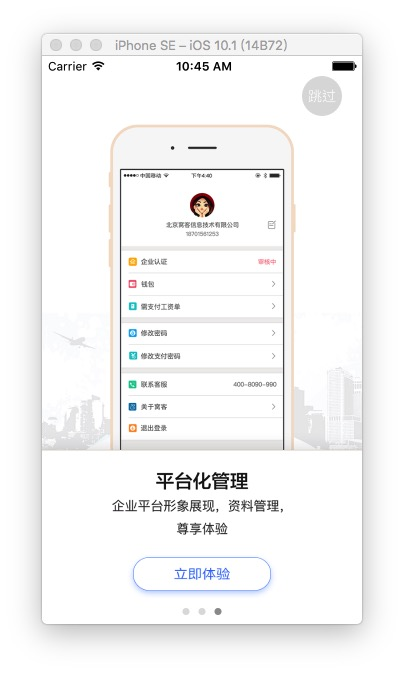

## zxcGuidePage是一个简单的APP引导页



##初始化方法

```
//初始化方法设定跳过(立即体验)执行操作
- (instancetype)initWithDismissBlock:(void(^)())endBlock;

```

##属性

```
//图片数组
@property (nonatomic,strong) NSMutableArray<UIImage*> * imgArr;

```

##注意

```
//图片数组需要在初始化的时候传入,或者直接在以下方法中修改
//-(NSArray *)getImageArray;

```


##End
若有任何问题欢迎发送邮件指正:[zhangxuchuan827@163.com](mailto:zhangxuchuan827@163.com)